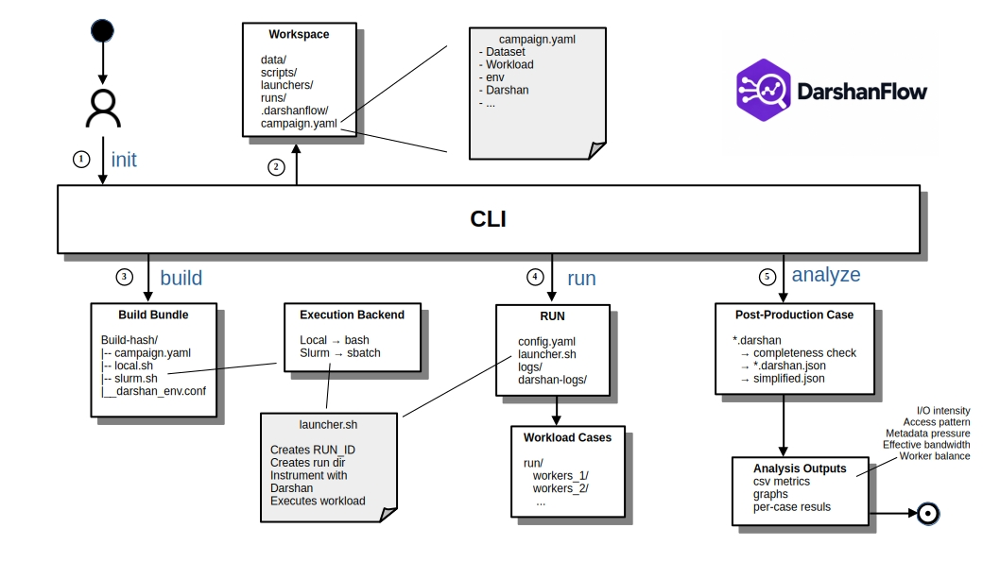

# DarshanFlow


A command-line tool for running Machine Learning I/O experiments with
[Darshan](https://www.mcs.anl.gov/research/projects/darshan/) instrumentation,
either locally or on Slurm, and then analyzing the results.

Everything is built around a **campaign**: a directory holding one experiment
description (`campaign.yaml`) plus everything produced from it (launchers, runs,
logs, metrics). The tool has no global state. A campaign is just a folder.




## Contents

- [Layout](#layout)
- [Requirements](#requirements)
- [Quick start](#quick-start)
- [Resulting campaign structure](#resulting-campaign-structure)
- [Key rules](#key-rules)
- [Current limitations and Future work (schema v1)](#current-limitations-and-future-work-schema-v1)
- [End-to-end example](#end-to-end-example)
  - [1. Initialize the campaign](#1-initialize-the-campaign)
  - [2. Add the workload and dataset](#2-add-the-workload-and-dataset)
  - [3. Configure the experiment](#3-configure-the-experiment)
    - [Workload and dataset](#workload-and-dataset)
    - [Experiment arguments and sweep](#experiment-arguments-and-sweep)
    - [Execution environment](#execution-environment)
    - [Darshan instrumentation](#darshan-instrumentation)
    - [Execution backend](#execution-backend)
    - [Post-experiment analysis](#post-experiment-analysis)
  - [4. Build the campaign](#4-build-the-campaign)
  - [5. Inspect execution with `--dry-run`](#5-inspect-execution-with---dry-run)
  - [6. Submit the experiment](#6-submit-the-experiment)
  - [7. Analyze the completed run](#7-analyze-the-completed-run)
- [Troubleshooting](#troubleshooting)
  - [PyDarshan and `libdarshan-util` version mismatch](#pydarshan-and-libdarshan-util-version-mismatch)
  - [`run` cannot find a build, or the build became stale](#run-cannot-find-a-build-or-the-build-became-stale)
  - [The Slurm job was submitted, but the run is incomplete](#the-slurm-job-was-submitted-but-the-run-is-incomplete)
  - [The workload ran, but no Darshan logs were produced](#the-workload-ran-but-no-darshan-logs-were-produced)
  - [Darshan logs exist, but expected records are missing](#darshan-logs-exist-but-expected-records-are-missing)
  - [More `.darshan` files than expected](#more-darshan-files-than-expected)
  - [Metrics or plots requested from the CLI are missing](#metrics-or-plots-requested-from-the-cli-are-missing)
  - [The launcher reports success even though the workload failed](#the-launcher-reports-success-even-though-the-workload-failed)

## Layout

| Path            | What it is                                                           |
|-----------------|----------------------------------------------------------------------|
| `cli.py`        | Entry point. Parses arguments and dispatches to the package.         |
| `darshanflow/`  | Lifecycle stages: campaign, config, builder, runner, analysis. See [darshanflow/README.md](darshanflow/README.md). |
| `darshanflow/post/` | Post-processing: log simplification and the five metrics. See [darshanflow/post/README.md](darshanflow/post/README.md). |
| `schema1.yaml`  | Annotated reference example of the schema-v1 `campaign.yaml`.         |

## Requirements

- Python 3.10+ with `pyyaml`
- To run experiments: `bash`, a Darshan build (`libdarshan.so`), and `sbatch`/`srun` for Slurm
- To analyze: `darshan-parser` on `PATH`, the Python `darshan` package (PyDarshan), and `matplotlib` (for graphs only)

## Quick start

```bash
# 1. Create a campaign (directories, starter campaign.yaml, manifest)
python3 cli.py init my-campaign

# 2. Put your workload and data in place, then edit my-campaign/campaign.yaml
#    (script, dataset, experiment args, sweep, darshan.library, slurm account...)
cp train.py   my-campaign/scripts/
cp data.h5    my-campaign/data/

# 3. Validate the config and generate launchers
python3 cli.py build my-campaign                  # every enabled target
python3 cli.py build my-campaign --target local   # only one target

# 4. Execute
python3 cli.py run my-campaign --target local --dry-run   # show what would run
python3 cli.py run my-campaign --target local             # runs now and streams output
python3 cli.py run my-campaign --target slurm             # sbatch submission only

# 5. Analyze a finished run
python3 cli.py analyze my-campaign                        # latest run, metrics/graphs set in its config
python3 cli.py analyze my-campaign --run hdf5_20260922_101500 --metrics io bandwidth --graphs none
```

`CAMPAIGN` defaults to the current directory for `build`, `run` and `analyze`.
Errors are reported as `error: ...` with exit code 1 and no traceback.

## Resulting campaign structure

```
my-campaign/
├── campaign.yaml                  # the only file you edit
├── .darshanflow/manifest.json     # marks the directory as a campaign
├── data/  scripts/
├── launchers/build-<ID>/          # one bundle per exact campaign.yaml content
│   ├── campaign.yaml              # byte-for-byte snapshot
│   ├── local.sh  slurm.sh
│   └── darshan_env.conf           # only in generated mode
└── runs/<format>_<YYYYMMDD_HHMMSS>/
    ├── config.yaml  launcher.sh   # provenance copied by the launcher
    ├── darshan_env.conf
    ├── logs/<case>.txt            # workload stdout/stderr
    ├── darshan_logs/<case>/       # raw *.darshan, never modified
    └── analysis/<case>/           # created by `analyze`, rebuilt on every run
```

A **case** is a single invocation of the workload: `workers_<N>` for each
`sweep.num_workers` value, or `run` when there is no sweep.

## Key rules

- **Any change to `campaign.yaml`, even a comment, requires a new `build`.**
  `run` only dispatches the bundle whose ID matches the current file bytes.
- Bundles and runs are never deleted or reused. They are the provenance record.
- `analyze` reads the run's `config.yaml` snapshot, not the live
  `campaign.yaml`. CLI flags can only narrow what that snapshot enables.

## Current limitations and Future work (schema v1)

Several limits are deliberate at this stage of development, and still in development for Darshanflow later iterations:

- **Ignored on purpose:**
  - `darshan.config.rank_include` / `rank_exclude` are validated but never
    written to `darshan_env.conf`. That file only keeps a commented example.
  - `campaign.name` is validated but only informational. It is not used in
    paths or IDs.
  - `dataset.format` only selects the run ID prefix (`WORKFLOW`). It is not
    passed to the workload or used by the analysis.
  - `environment.sanity_imports` is diagnostic only. It prints module locations
    and changes nothing.
- `workload.type` supports only `python`. The workload runs as
  `python3 <script> --data-path <dataset> [experiment flags] [--num-workers N]`.
- `sweep` supports only `num_workers`.
- Slurm: every case runs as one `srun --ntasks=1` task. `nodes` only feeds
  `#SBATCH`, and there is no MPI or multi-rank execution.
- `run --target slurm` submits the job but does not track it. Run `analyze`
  only after the job has finished. Incomplete runs are rejected.
- `.darshanflow/manifest.json` is written once by `init` and never updated.
- `analyze` handles one run at a time. There is no comparison across runs.


---

## End-to-end example

The following example shows a complete HDF5 campaign running on a Slurm system.


### 1. Initialize the campaign

Create a new campaign with:

```bash
python cli.py init campaign
```

DarshanFlow creates the campaign directory and its initial structure.


The initial campaign contains the configuration file and directories for the
dataset, workload, generated launchers, and experiment runs.

```text
campaign/
├── campaign.yaml
├── data/
├── launchers/
├── runs/
└── scripts/
```

### 2. Add the workload and dataset

Place the training program under `scripts/` and the input dataset under `data/`.

For this example:

```text
campaign/
├── campaign.yaml
├── data/
│   └── mc_normalized_rntuple_10M.h5
├── launchers/
├── runs/
└── scripts/
    └── hdf5_tr.py
```

The campaign is now self-contained: its configuration refers to files relative
to this directory.

### 3. Configure the experiment

The campaign is defined in `campaign.yaml`. The file describes the workload,
dataset, experiment parameters, execution environment, Darshan instrumentation,
execution backend, and post-processing settings.

#### Workload and dataset

The workload section identifies the program that DarshanFlow will execute, while
the dataset section specifies its input data.

```yaml
workload:
  type: python
  script: scripts/hdf5_tr.py

dataset:
  format: hdf5
  path: data/mc_normalized_rntuple_10M.h5
```

In this campaign, `hdf5_tr.py` is the training workload and
`mc_normalized_rntuple_10M.h5` is the HDF5 dataset passed to it.

#### Experiment arguments and sweep

Arguments that remain fixed across all cases are declared under `experiment`:

```yaml
experiment:
  strategy: eager
  model: M2
  batch_size: 64
  epochs: 1
  log_every: 50000
  persistent_workers: true
```

DarshanFlow translates these entries into command-line arguments for the
workload.

Parameters that vary between cases are declared separately under `sweep`:

```yaml
sweep:
  num_workers:
    - 32
```

This configuration contains one case, `workers_32`. A larger list would produce
one case for each worker count.


#### Execution environment

The `environment` section describes the runtime environment required by the
workload:

```yaml
environment:

  venv: /pscratch/sd/s/satt/sprints/myvenv

  variables:
    OMP_NUM_THREADS: 4
    MKL_NUM_THREADS: 4
    OPENBLAS_NUM_THREADS: 4
    NUMEXPR_NUM_THREADS: 4

  setup:
    local: []

    slurm:
      - 'export ATLAS_LOCAL_ROOT_BASE=/cvmfs/atlas.cern.ch/repo/ATLASLocalRootBase'
      - 'source ${ATLAS_LOCAL_ROOT_BASE}/user/atlasLocalSetup.sh'
      - 'lsetup prmon'
      - 'asetup Athena,main--dev3LCG,latest'

  sanity_imports:
    - torch
    - h5py
```

`venv` selects the Python virtual environment. `variables` defines environment
variables exported before the workload starts, while `setup.slurm` contains
site-specific shell commands executed on Slurm systems.

`sanity_imports` is diagnostic: DarshanFlow imports the listed Python modules
and prints their resolved locations before running the experiment.


#### Darshan instrumentation

Darshan instrumentation is configured directly in the campaign:

```yaml
darshan:
  enabled: true

  library: /path/to/darshan/lib/libdarshan.so

  nonmpi: true
  dxt: true

  config:
    mode: generated
    path: darshan_env.conf
```

`library` must point to the Darshan runtime library available on the target
system. With `nonmpi: true`, DarshanFlow enables instrumentation for non-MPI
applications, and `dxt: true` enables DXT tracing.

When `config.mode` is `generated`, DarshanFlow creates `darshan_env.conf` from
the remaining configuration entries.

Record limits can be configured per module:

```yaml
config:
  max_records:
    POSIX: 5000
    DXT_POSIX: 325520
```

File paths can be excluded from instrumentation using regular expressions:

```yaml
  name_exclude:
    - '\.pyc$'
    - '^/cvmfs'
    - '^/lib64'
    - '^/lib'
    - '^/gpfs/'
    - '^/work2'
    - '^/tmp'
    - '^/dev'
    - '^/scratch1'

  name_include: []
```

The campaign can similarly restrict which applications are instrumented:

```yaml
  app_exclude:
    - git
    - ls
    - sh
    - hostname
    - sed
    - g++
    - date
    - cc1plus
    - cat
    - which
    - tar
    - ld
    - prmon
    - uname
    - ps
    - rm
    - tee
    - srun

  app_include:
    - python
```

Here, Python processes are explicitly included while common shell and utility
programs are excluded, preventing unrelated operations from producing Darshan
logs.

Additional runtime settings are also exposed:

```yaml
  modmem: 100

  rank_exclude: []
  rank_include: []

  dxt_small_io_trigger: 0.01

  dump_config: false
```

`modmem` controls Darshan module memory allocation, while
`dxt_small_io_trigger` configures the threshold used by DXT for retaining
small-I/O traces.

`rank_include` and `rank_exclude` are part of the schema but are not emitted
into generated Darshan configuration files in schema v1.

#### Execution backend

The campaign can define both local and Slurm execution, with each backend
independently enabled or disabled.

```yaml
execution:

  local:
    enabled: false

  slurm:
    enabled: true

    nodes: 1
    cpus_per_task: 256
    time: "12:00:00"

    constraint: cpu
    qos: regular
    account: m2845
```

For this campaign, local execution is disabled and Slurm is enabled.
DarshanFlow translates these values into the corresponding `#SBATCH`
directives when generating the Slurm launcher.

#### Post-experiment analysis

The final section specifies which analyses should run after the experiment:

```yaml
analysis:

  metrics:

    io:
      enabled: true

    access:
      enabled: true

    metadata:
      enabled: true

    bandwidth:
      enabled: true

    balance:
      enabled: true

  graphs:

    compact:
      enabled: true

    individual:
      enabled: false
```

The five metric families are enabled here, together with compact graph
generation. Individual per-metric graphs remain disabled.

These settings are stored with the run and later used by `analyze`, so analysis
is tied to the same configuration snapshot that produced the experiment.


### 4. Build the campaign

Before execution, the campaign must be built:

```bash
python cli.py build campaign/ --target slurm
```

A build validates the configuration and creates an immutable launcher bundle:

```text
campaign/
└── launchers/
    └── build-c15473fc79e1/
        ├── campaign.yaml
        ├── darshan_env.conf
        └── slurm.sh
```


The build ID is derived from the exact `campaign.yaml` contents. Therefore, the
bundle identifies the exact configuration from which it was generated.

The generated Slurm launcher contains the requested scheduler configuration,
environment setup, virtual environment activation, workload invocation, and
Darshan environment.


When `darshan.config.mode: generated` is used, DarshanFlow also produces the
corresponding `darshan_env.conf`.


The generated file translates the relevant YAML options into Darshan runtime
configuration such as DXT modules, record limits, path filters, application
filters, and DXT small-I/O settings.

### 5. Inspect execution with `--dry-run`

Before submitting the job, the exact launcher can be checked without executing
anything:

```bash
python3 ../cli.py run . --target slurm --dry-run
```


DarshanFlow resolves the build corresponding to the current campaign and shows
the command that would be executed.

### 6. Submit the experiment

Submit the campaign with:

```bash
python3 ../cli.py run . --target slurm
```

For Slurm, `run` performs the submission and reports the resulting batch job ID.
It does not wait for or track job completion.

Each sweep value becomes a **case**. A case is one invocation of the workload
and is named:

```text
workers_<N>
```

If no worker sweep is configured, the case is named:

```text
run
```

During execution, raw Darshan logs are stored separately for each case.

Multiple `.darshan` files may be produced for one case because the parent Python
process and DataLoader worker processes are instrumented independently.

### 7. Analyze the completed run

After the Slurm job has finished, analyze the run with:

```bash
python3 cli.py analyze campaign --run latest --metrics all --graphs all
```

The analysis stage:

1. discovers the Darshan logs belonging to each case;
2. converts them to JSON;
3. applies the configured inclusion and exclusion filters;
4. produces a normalized `simplified.json`;
5. computes the selected metrics;
6. generates the requested graphs.

The simplification stage also identifies parent and worker processes and reports
how many records from each log were retained.


A completed run keeps execution provenance, raw logs, workload output, and
analysis results together:


For each case, analysis output is separated by metric:

```text
analysis/workers_32/
├── access/
├── balance/
├── bandwidth/
├── checks/
├── io/
├── json/
├── metadata/
└── simplified.json
```

At completion, DarshanFlow reports the number of successful and failed cases and
the location of the generated analysis. 

Here is the status of the directory of the described example at the end of the loop:

```
.
├── campaign.yaml
├── data
│   └── mc_normalized_rntuple_10M.h5
├── launchers
│   └── build-c15473fc79e1
│       ├── campaign.yaml
│       ├── darshan_env.conf
│       └── slurm.sh
├── runs
│   └── hdf5_20260915_065425
│       ├── analysis
│       │   └── workers_32
│       │       ├── access
│       │       ├── balance
│       │       ├── bandwidth
│       │       ├── checks
│       │       ├── io
│       │       ├── json
│       │       ├── metadata
│       │       └── simplified.json
│       ├── config.yaml
│       ├── darshan_env.conf
│       ├── darshan_logs
│       │   └── workers_32
│       │       ├── satt_python3_id617945-617945_9-15-24866-2506234444189183387_1.darshan
│       │       ├── satt_python3_id617945-617987_9-15-24905-3046823732300316721_1.darshan
│       │       ├── satt_python3_id617945-617988_9-15-24905-1100529832424311032_1.darshan
│       │       ├── satt_python3_id617945-617989_9-15-24905-6383561448811509936_1.darshan
│       │       ├── satt_python3_id617945-617990_9-15-24905-12692896219747443793_1.darshan
│       │       ├── satt_python3_id617945-617994_9-15-24905-3827131302455158497_1.darshan
│       │       ├── satt_python3_id617945-618001_9-15-24905-10770682974994527273_1.darshan
│       │       ├── satt_python3_id617945-618005_9-15-24905-771956025853291629_1.darshan
│       │       ├── satt_python3_id617945-618009_9-15-24905-3531488561374975918_1.darshan
│       │       ├── satt_python3_id617945-618011_9-15-24905-328233731623498846_1.darshan
│       │       ├── satt_python3_id617945-618017_9-15-24905-2285935353007855580_1.darshan
│       │       ├── satt_python3_id617945-618021_9-15-24905-14346789489200826010_1.darshan
│       │       ├── satt_python3_id617945-618022_9-15-24905-18418135780413664249_1.darshan
│       │       ├── satt_python3_id617945-618029_9-15-24905-1369835230426482146_1.darshan
│       │       ├── satt_python3_id617945-618033_9-15-24905-17561631238595779110_1.darshan
│       │       ├── satt_python3_id617945-618043_9-15-24905-12444804990626427368_1.darshan
│       │       ├── satt_python3_id617945-618044_9-15-24905-114989376377877904_1.darshan
│       │       ├── satt_python3_id617945-618045_9-15-24905-1323152218421639392_1.darshan
│       │       ├── satt_python3_id617945-618046_9-15-24905-14479903959341955132_1.darshan
│       │       ├── satt_python3_id617945-618050_9-15-24905-1973313031553978351_1.darshan
│       │       ├── satt_python3_id617945-618054_9-15-24905-16533675712158925830_1.darshan
│       │       ├── satt_python3_id617945-618061_9-15-24905-1951179669484806285_1.darshan
│       │       ├── satt_python3_id617945-618065_9-15-24905-11290778605296909480_1.darshan
│       │       ├── satt_python3_id617945-618069_9-15-24905-17875813961669516666_1.darshan
│       │       ├── satt_python3_id617945-618070_9-15-24905-2071622064161494699_1.darshan
│       │       ├── satt_python3_id617945-618071_9-15-24905-12872001856937029126_1.darshan
│       │       ├── satt_python3_id617945-618075_9-15-24905-17123275490509761263_1.darshan
│       │       ├── satt_python3_id617945-618085_9-15-24905-13471220073783699163_1.darshan
│       │       ├── satt_python3_id617945-618089_9-15-24905-13200812842805839855_1.darshan
│       │       ├── satt_python3_id617945-618093_9-15-24905-12824762917278199173_1.darshan
│       │       ├── satt_python3_id617945-618097_9-15-24905-12650942678705449884_1.darshan
│       │       ├── satt_python3_id617945-618107_9-15-24906-12872001856937029126_1.darshan
│       │       └── satt_python3_id617945-618108_9-15-24906-9223209897891232820_1.darshan
│       ├── launcher.sh
│       └── logs
│           └── workers_32.txt
├── scripts
│   └── hdf5_tr.py
├── slurm-58358130.out
└── slurm-58358409.out

18 directories, 46 files
```

## Troubleshooting

DarshanFlow is still under active development. When a campaign fails, first determine whether the problem happened during the build, workload execution, Darshan instrumentation, or post-processing. A run directory keeps the configuration snapshot, launcher, workload output, raw Darshan logs, and analysis output, so most problems can be investigated without modifying generated files.

### PyDarshan and `libdarshan-util` version mismatch

During JSON conversion, analysis may fail with an error similar to:

```text
FAILED: JSON conversion of <log>.darshan failed with exit code 1:
darshan.discover_darshan.DarshanVersionError:
This version of PyDarshan requires lib 3.4.6.
```

This error comes from the analysis environment. PyDarshan requires a compatible version of `libdarshan-util` and refuses to load a different one.

This is separate from `darshan.library` in `campaign.yaml`, which selects the Darshan runtime library preloaded while the workload is executed. Changing that runtime path is therefore not the first fix for this error.

Check the environment in which `analyze` is running:

```bash
python3 -c 'import darshan; print(darshan.__darshanutil_version__)'
which darshan-parser
```

If the environment exposes a different Darshan installation, activate the intended virtual environment or adjust the relevant `PATH` / `LD_LIBRARY_PATH` settings so that PyDarshan and `libdarshan-util` come from compatible installations. Then rerun `analyze`; the raw `.darshan` files do not need to be regenerated.

Automatic handling of multiple Darshan analysis-library versions is not implemented yet.

### `run` cannot find a build, or the build became stale

DarshanFlow identifies a build from the exact contents of `campaign.yaml`. Even changing a comment changes the expected build ID.

If `campaign.yaml` has changed since the last build, generate a new launcher bundle:

```bash
python3 cli.py build my-campaign --target slurm
```

or:

```bash
python3 cli.py build my-campaign --target local
```

The requested execution target must also be enabled in `campaign.yaml`.

Before submitting again, `--dry-run` can be used to check which launcher DarshanFlow resolves:

```bash
python3 cli.py run my-campaign --target slurm --dry-run
```

Do not repair this by editing files under `launchers/`. Generated launchers are snapshots of the campaign configuration and should be rebuilt from the YAML.

### The Slurm job was submitted, but the run is incomplete

`run --target slurm` stops after `sbatch` accepts the job. It does not wait for the allocation or track whether the workload eventually succeeds.

If analysis reports an incomplete run, first check the scheduler state and wait until the job has finished. Then inspect the output produced by the workload:

```text
runs/<RUN_ID>/logs/<case>.txt
```

and the scheduler output, for example:

```text
slurm-<JOB_ID>.out
```

A successful `sbatch` submission only means that Slurm accepted the job. It does not mean that the workload completed successfully.

### The workload ran, but no Darshan logs were produced

For each case, raw logs should appear under:

```text
runs/<RUN_ID>/darshan_logs/<case>/
```

If the directory is empty, start with the corresponding workload log:

```text
runs/<RUN_ID>/logs/<case>.txt
```

A Python exception, missing dataset, invalid environment setup, or failed library preload can stop the workload before a usable Darshan log is written.

If the workload itself completed, inspect the run's `launcher.sh`, `config.yaml`, and `darshan_env.conf`. In particular, verify that the configured `darshan.library` exists on the execution node, that Darshan instrumentation is enabled, and that non-MPI instrumentation is enabled for Python workloads.

Application filters can also remove the processes that were meant to be instrumented. Check `app_include` and `app_exclude` if the program runs normally but no expected Python logs appear.

### Darshan logs exist, but expected records are missing

A `.darshan` file does not guarantee that every file accessed by the workload was retained.

After analysis, inspect:

```text
runs/<RUN_ID>/analysis/<case>/checks/
```

and:

```text
runs/<RUN_ID>/analysis/<case>/simplified.json
```

The simplification stage reports which parent and worker records were retained. If the target dataset is missing, compare its path with the configured `name_include` and `name_exclude` expressions and check the application filters as well.

Record limits may also matter for Python workloads that touch many files. Review `config.max_records` and `modmem` when Darshan reports exhausted record or module memory.

If DXT data is expected, also confirm that DXT was enabled when the experiment was executed.

Changes to instrumentation settings require a new build and a new run. Post-processing cannot recover records that were not collected by Darshan.

### More `.darshan` files than expected

One experimental case does not necessarily correspond to one Darshan file.

With multiprocessing data loaders, the parent Python process and worker processes can be instrumented independently. A case such as:

```text
workers_32
```

may therefore contain many `.darshan` files.

This is expected. DarshanFlow combines the records during simplification and identifies parent and worker processes before computing the metrics. An unexpectedly large number of unrelated logs, however, may indicate that `app_include` / `app_exclude` is too permissive.

### Metrics or plots requested from the CLI are missing

`analyze` uses the `config.yaml` stored inside the run, not the current `campaign.yaml`.

The CLI options can restrict what was enabled in that snapshot, but they cannot enable analysis modes that were disabled when the run was created. For example:

```bash
python3 cli.py analyze my-campaign --run latest --graphs all
```

does not override a run whose stored configuration disabled those graph modes.

Inspect:

```text
runs/<RUN_ID>/config.yaml
```

to see the analysis configuration associated with that run.

Graph generation also requires Matplotlib. `compact` and `individual` are separate graph modes; enabling compact output alone does not produce the individual `io` plots.

### The launcher reports success even though the workload failed

Current launchers pipe workload output through `tee`. In some cases, the status returned by that pipeline can hide a non-zero exit status from the workload itself.

If a case appears successful but its outputs are missing or incomplete, inspect:

```text
runs/<RUN_ID>/logs/<case>.txt
```

for the original workload error. Until pipeline exit propagation is tightened in the launcher, a successful launcher status should not be used by itself as proof that the training script completed correctly.

*If a failure is not covered here, please open an issue with the command that was executed, the reported error, the run's `config.yaml`, and the relevant `logs/<case>.txt` output. For analysis failures, include the corresponding `analysis/<case>/checks/` output when available.*
